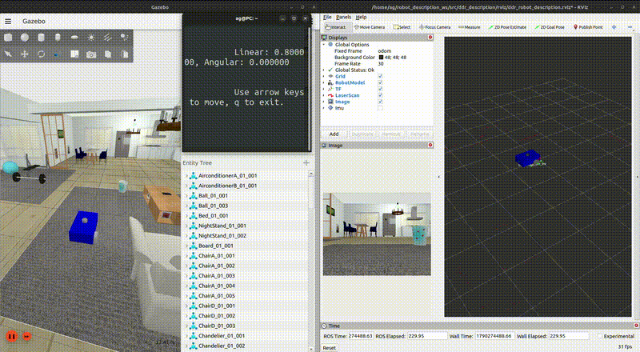
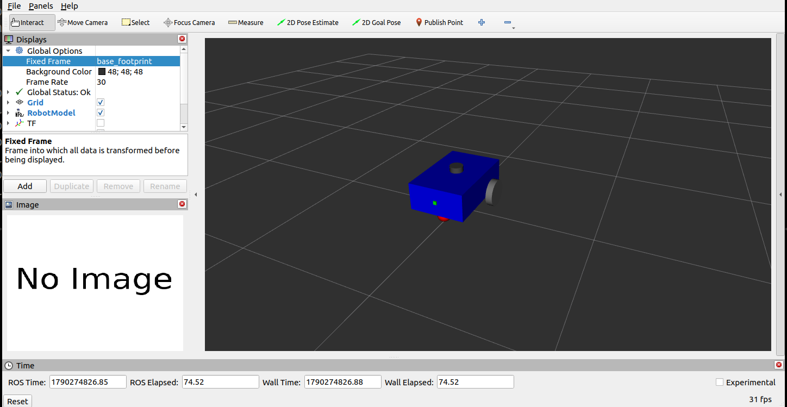

# ROS 2 Robot Description Workspace

A practical ROS 2 workspace focused on **robot description, simulation, sensors, TF2, and CAD-based digital twins** using URDF, Xacro, RViz2, Gazebo, and ros2_control.

## Demo



**Differential-Drive Robot — Basic Model**

A complete simulated differential-drive robot with ROS 2 control, Gazebo sensors, TF2, RViz2 visualization, and keyboard teleoperation.

## Overview

This workspace is designed to demonstrate the workflow of building a robot from its description to a functional ROS 2 digital twin.

```text
CAD / Robot Design
        ↓
    URDF / Xacro
        ↓
       TF2
        ↓
      RViz2
        ↓
      Gazebo
        ↓
   ros2_control
        ↓
  Sensors & Plugins
        ↓
    ROS 2 Digital Twin
```

## Projects

### 1. Differential-Drive Robot — Basic Model

A complete differential-drive robot built using primitive URDF/Xacro geometries.



#### Features

* URDF / Xacro robot description
* Modular Xacro properties and macros
* TF2 frame hierarchy
* RViz2 visualization
* Gazebo simulation
* `ros2_control`
* Differential-drive controller
* Wheel friction and contact tuning
* Odometry and TF publishing
* LiDAR simulation
* Camera simulation
* IMU simulation
* ROS 2 ↔ Gazebo topic bridging
* Keyboard teleoperation
* Motion testing scripts
* Sensor validation scripts
* Multiple Gazebo worlds

### Robot TF Tree

The final TF structure is:

```text
odom
└── base_footprint
    └── base_link
        ├── right_wheel_link
        ├── left_wheel_link
        ├── caster_wheel_link
        ├── laser_link
        ├── camera_link
        │   └── camera_optical_frame
        └── imu_link
```

[View the generated TF2 frame graph](src/ddr_description/frame/frames_ddr.pdf)

### Sensors

| Sensor | ROS 2 Topic     |   Rate |
| ------ | --------------- | -----: |
| LiDAR  | `/scan`         |   5 Hz |
| Camera | `/camera/image` |  30 Hz |
| IMU    | `/imu/out`      | 100 Hz |

### Motion Control

The robot is controlled using `diff_drive_controller`.

The main velocity command interface is:

```text
/ddr_controller/cmd_vel_unstamped
```

Keyboard teleoperation is provided through:

```bash
./src/ddr_description/scripts/teleop.sh
```

Automated motion testing is available through:

```bash
./src/ddr_description/scripts/test_motion.sh
```

### Sensor Testing

Sensor publishing rates can be checked using:

```bash
./src/ddr_description/scripts/test_sensors.sh
```

## Package Structure

```text
robot_description_ws/
├── media/
│   ├── ddr.png
│   └── ddr_demo.gif
│
├── src/
│   ├── ddr_description/
│   │   ├── config/
│   │   │   ├── ddr_controllers.yaml
│   │   │   └── gz_bridge.yaml
│   │   │
│   │   ├── frame/
│   │   │   ├── frames_ddr.gv
│   │   │   └── frames_ddr.pdf
│   │   │
│   │   ├── launch/
│   │   │   ├── display.launch.py
│   │   │   ├── display.launch.xml
│   │   │   └── gazebo.launch.py
│   │   │
│   │   ├── models/
│   │   ├── photos/
│   │   ├── rviz/
│   │   │   └── ddr_robot_description.rviz
│   │   │
│   │   ├── scripts/
│   │   │   ├── rviz.sh
│   │   │   ├── teleop.sh
│   │   │   ├── test_motion.sh
│   │   │   └── test_sensors.sh
│   │   │
│   │   ├── urdf/
│   │   │   ├── ddr_robot.urdf.xacro
│   │   │   ├── gazebo.xacro
│   │   │   ├── properties.xacro
│   │   │   └── ros2_control.xacro
│   │   │
│   │   ├── worlds/
│   │   │   ├── empty.world
│   │   │   ├── small_house.world
│   │   │   └── small_warehouse.world
│   │   │
│   │   ├── CMakeLists.txt
│   │   └── package.xml
│   │
│   └── tf2_demo/
│       ├── tf2_demo/
│       │   ├── __init__.py
│       │   └── tf2_listener.py
│       ├── resource/
│       ├── test/
│       ├── package.xml
│       ├── setup.cfg
│       └── setup.py
│
├── .gitignore
└── README.md
```

## TF2 Demo

The workspace also contains a small standalone TF2 listener package.

It demonstrates how to query a transform between two frames using `tf2_ros`.

Example:

```text
base_link
    ↓
laser_link
```

The listener reports both translation and rotation:

```text
Translation:
x = ...
y = ...
z = ...

Rotation:
x = ...
y = ...
z = ...
w = ...
```

## Running the Simulation

Build the workspace:

```bash
cd ~/robot_description_ws

colcon build --symlink-install

source install/setup.bash
```

Launch the DDR simulation:

```bash
ros2 launch ddr_description gazebo.launch.py
```

### RViz2

```bash
./src/ddr_description/scripts/rviz.sh
```

### Keyboard Teleoperation

```bash
./src/ddr_description/scripts/teleop.sh
```

### Motion Test

```bash
./src/ddr_description/scripts/test_motion.sh
```

### Sensor Test

```bash
./src/ddr_description/scripts/test_sensors.sh
```

## Useful ROS 2 Commands

Check active topics:

```bash
ros2 topic list
```

Check LiDAR:

```bash
ros2 topic hz /scan
```

Check camera:

```bash
ros2 topic hz /camera/image
```

Check IMU:

```bash
ros2 topic hz /imu/out
```

Inspect TF:

```bash
ros2 run tf2_tools view_frames
```

Inspect the transform between two frames:

```bash
ros2 run tf2_ros tf2_echo odom base_footprint
```

## Technologies

* **ROS 2 Humble**
* **URDF**
* **Xacro**
* **TF2**
* **RViz2**
* **Gazebo Sim**
* **ros2_control**
* **diff_drive_controller**
* **ros_gz_bridge**
* **LiDAR**
* **Camera**
* **IMU**
* **Python**
* **Bash**

## Repository Scope

This repository focuses on the **robot description and simulation layer** of a robotics software stack.

The main areas are:

* Robot modeling
* URDF and Xacro
* Coordinate frames and TF2
* Visualization
* Physics simulation
* Robot controllers
* Sensor simulation
* Gazebo–ROS 2 integration
* CAD-to-ROS workflows
* Digital twins

Higher-level systems such as SLAM, Navigation, autonomous task planning, and application-level robotics are outside the primary scope of this repository.

## Roadmap

| Project                   | Status      |
| ------------------------- | ----------- |
| DDR — Basic Model         | ✅ Completed |
| DDR — CAD Model           | 🚧 Next     |
| Manipulator — Basic Model | 📋 Planned  |
| Manipulator — CAD Model   | 📋 Planned  |

### Upcoming: DDR CAD Model

The next stage is to replace the primitive robot geometry with a CAD-based model and demonstrate the complete CAD-to-ROS workflow:

```text
SolidWorks
    ↓
CAD Model
    ↓
Mesh Export
    ↓
ROS 2 Meshes
    ↓
Xacro Integration
    ↓
Visual + Collision + Inertial
    ↓
Gazebo Digital Twin
```

## Author

**Ahmed Gaber**

Mechatronics Engineer | Robotics Software Engineer

